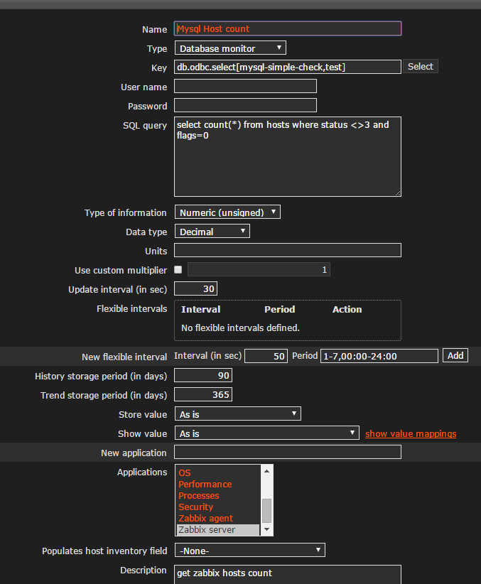

ODBC Database Monitor
====================

** 如果自己是使用的编译源码的方式，ODBC 默认是没有编译进去的，另外ODBC的相关包也没有安装，需要额外进行安装**

操作步骤如下：

* centos 类似平台执行下面命令安装unixODBC 以及相关开发包
<pre>
  yum -y install unixODBC unixODBC-devel
</pre>

* 安装 mysql-odbc-connnector
<pre>
  yum install mysql-connector-odbc
</pre>

* 重新编译zabbix 以支持ODBC
<pre>
[vagrant@zabbix ~]$ sudo ./configure --enable-server --enable-agent --prefix=/usr/local --sysconfdir=/etc --enable-java --with-mysql --with-libcurl --with-net-snmp --with-unixodbc --with-ldap --with-iconv --with-libxml2
&& sudo make && sudo make install
</pre>

* 编辑ODBC.ini 来定义ODBC 连接
  *  看下ODBC的设置
    <pre>
      odbcinst -j
    </pre>
 * 编辑/etc/odbc.ini
  <pre>
  [vagrant@zabbix ~]$ cat /etc/odbc.ini
      [test]
      Description     = mysql test database
      Driver          = mysql
      Server          = 127.0.0.1
      User            = root
      Password        = topsecret
      Port            = 3306
      Database        = zabbix
  </pre>
  * *以上设置是按照目前的实验环境进行的设置*
  * *其实User 和Password 部分可以不设置，在zabbix Database monitor Item 的配置页面也可以制定username 和paswword*

* 测试ODBC设置，isql是unixODBC包中含有的命令
  <pre>
    [vagrant@zabbix ~]$ isql test
      +---------------------------------------+
      | Connected!                            |
      |                                       |
      | sql-statement                         |
      | help [tablename]                      |
      | quit                                  |
      |                                       |
      +---------------------------------------+
  </pre>

* Zabbix ODBC Item 配置如下图

*本文参考链接*

[ODBC monitoring](https://www.zabbix.com/documentation/2.4/manual/config/items/itemtypes/odbc_checks)
